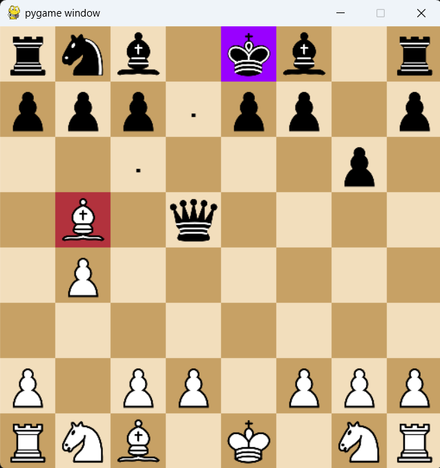

# ♟️ Chess Game

 #### its a chess game project using Python and Pygame
 #### Made for AP project.
 #### This is a complete chess game built using **Python** and the **Pygame** library. It supports all standard chess rules like **check**, **checkmate**, **stalemate**, **castling**, **en passant**, and **pawn promotion**. The game also includes a graphical user interface where players can click and move pieces easily.

---

## ✅ Features

- Full chess logic implemented
- Beautiful board and piece graphics (with `pygame`)
- Handles all game rules:
  - Castling (both sides)
  - En passant
  - Pawn promotion
  - Check and checkmate
  - Draw (stalemate, only two kings, or after 11 moves by only kings)
- Shows all possible moves for selected piece
- Highlights the king when in check
- Supports going back to a previous state when the move is invalid

---

## 📁 Folder Structure

```
project/
│
├── img/
│   ├── wK.png
│   ├── bP.png
│   └── ... (all other piece images)
│
├── chess.py
├── README.md
```

---

## ▶️ How to Run

### Requirements

Install Pygame:

```bash
pip install pygame
```

### Start the Game

```bash
python chess.py
```

---

## 🧠 Code Structure

| Class       | Description                                |
|-------------|--------------------------------------------|
| `Board`     | Handles graphics, board state, mouse events |
| `GameState` | Contains the rules and logic of the game    |
| `Move`      | Stores move data like start and end squares |
| `Pawn`, `Rook`, `Knight`, `Bishop`, `Queen`, `King` | Each piece has its own class for moves |

---

## 📦 Libraries Used

| Library  | Use                     |
|----------|-------------------------|
| pygame   | Drawing the board and handling input |

---

## 🧩 Notes

- When a pawn reaches the last row, it can promote to another piece.
- All legal moves are shown after clicking a piece.
- If the king is in check, the square is highlighted in purple.
- The game ends with a message when there is checkmate or draw.

---

## 💻 Game UI Picture : 


